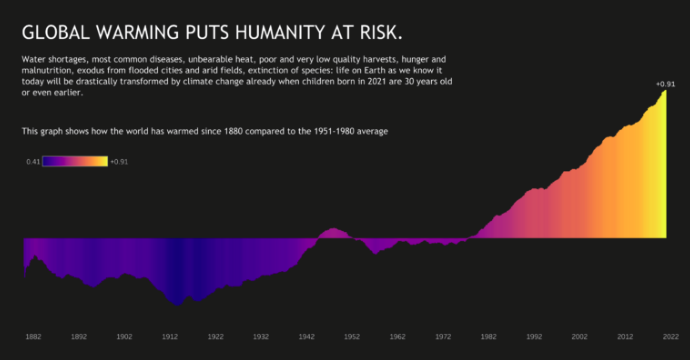

# Gallery

## Individual visualizations

### [Global Land Use](https://ourworldindata.org/land-use-diets)

### [UK Land Use](https://www.carbonbrief.org/qa-will-englands-national-food-strategy-help-tackle-climate-change/)

### [Carbon Dioxide]([https://ourworldindata.org/land-use-diets](https://blog.datawrapper.de/wp-content/uploads/2021/11/image29-1024x835.png))

### [Economic Growth](https://twitter.com/MaxCRoser/status/1454790570593955840?s=20&t=s5s9TgYVhWs6EGiXbtzTxg)

### [Global Temperature Projections]([https://twitter.com/MaxCRoser/status/1454790570593955840?s=20&t=s5s9TgYVhWs6EGiXbtzTxg](https://www.theguardian.com/environment/ng-interactive/2021/oct/14/climate-change-happening-now-stats-graphs-maps-cop26))

### [CO2 Footprint](https://raw.githubusercontent.com/datacomics/datacomics.github.io/master/comicfiles/co2footprint.jpg)

## Dashboards

## Data Stories
### [What is really warming the world?](https://www.bloomberg.com/graphics/2015-whats-warming-the-world/)

