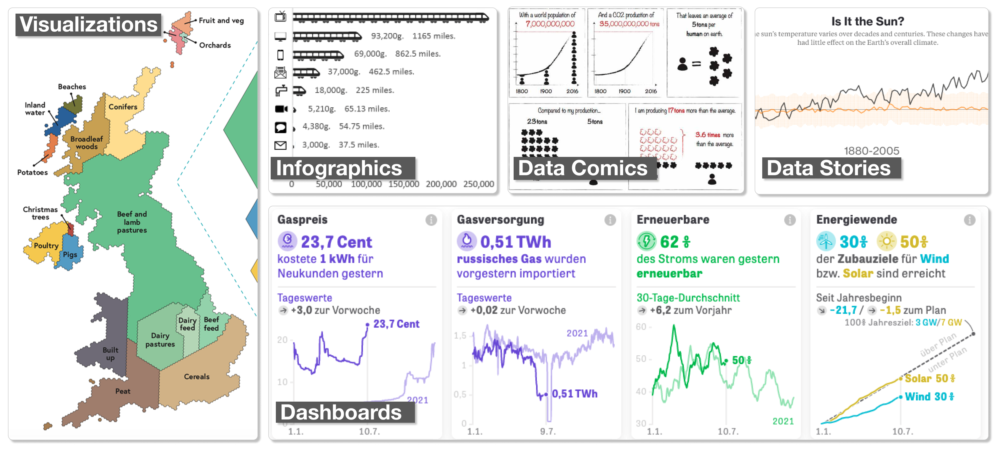

## About this project

This project aims to [empower](#what-do-we-mean-by-empowerment) communities, citizens, researchers, and decision makers in creating effective data visualization for climate action and decision making. Data visualization is a powerful means to understand data, whether to understand and explore complex and heterogenous data sets, obtain quick overviews over large data sets, or effectively communicate and engage diverse audiences with the matter at hand. Decision making is key to climate action, whether on a larger scale of politics, or on an individual level of personal daily decisions. Clearly, these decisions must be informed and backed up by data. Effective visualizations and communication can help people and decision makers making better decisions.

This website is part of an application to the [UKRI call on Enabling human centred decision making through data visualisation](https://www.ukri.org/opportunity/enabling-human-centred-decision-making-through-data-visualisation). The project will propose an open online authoring platform to guide novice designers in creating effective data visualizations and data stories.

## Who are we?

We are a group of researchers in Data Visualization, Human-Computer Interaction, Design, Artificial Intelligence, Learning Analytics, and Education. We are primarily based at the [VisHub Lab](https://vishub.net) at Design Informatics, the School of Informatics, University of Edinburgh with an international team of scientific collaborators. We have been involved in many interdisciplinary projects with domain scientists, the public, and teach data visualization to graduate students and working professionals. We also run the Edinburgh DataVis Meetup.

### [>> Get in touch](#contact)

## Why can designing and creating effective visualizations be a challenge? 
Visualization design requires both creative and critical design methods on the one side, and authoring tools on the other side. Creating such visualizations involves skills in design, programming, human-computer interaction, psychology, storytelling and potentially other areas. With this project, we seek to engage with everyone creating and using visualization to research the next generation of tools and methods for visualization empowerment. 

Some of the challenges in creating effective visualizations include: 
- Defining your problem, create usage scenarios, understand your intended audience,
- Format, filter, and clean data,
- Explore visualization design solutions, e.g., chart types,
- Decide on a one or a series of complementary visualizations,
- Make visualization design effective and attractive,
- Create compelling stories, annotations, and interactions,
- Create visualizations for your data,
- Critiquing a visualization design and make it accessible,
- Publish and distribute these on the web,
- ...
 
Learning these decisions and skills requires time and practice as a lot of the knowledg is tacit: you learn best by doing. One way to learn about visualization design are courses, but courses are time-intense for both participants and teachers and the engagement between learner and student usually does not last long beyond the course. So, how we can we provide design and education support beyond courses and workshops, e.g., while people work on own their projects in their daily working environment? 

Eventually, there are plenty of tools (see [vistools.net](https://vistools.net)) to create visualizations. However, choosing a tool that suits your needs and skills and consequently learning these tools can be challenging. Not every tool is the same. No tool support the whole process from data formatting, visualization design, and publication, 

## What do we mean by 'Empowerment'? 

By empowerment we mean the independent use, design and creation of effective data visualization. To that end, this project aims to provide **tools and training** for novice designers, addressing the following set of learning goals:

* **USE** a wide range of visualizations in an informed way, know their advantages and pitfalls;
leverage the power of interaction.
* **PREPARE** data sets for visualization; clean and format data; filter and aggregate; link data
files.
* **DESIGN** visualizations that are clear, effective, and informative; explore design spaces
and possibilities; iterate designs; create accessible visualizations; 
* **CREATE** visualizations in the form of infographics, dashboards, interactives, or data comics; add clear explanations and annotations; share online with a wider audience;
* **CRITIQUE** visualization designs and existing visualizations; make informed design decisions;
question existing practices
* **COMMUNICATE** information in visualizations through clear and engaging ways of storytelling;
know and apply basic means of storytelling; chose effective media depending on audience,
context, and messages

## What's the appraoch and contribution of this proposal?

The contribution of this proposal is to create an **open online authoring platform that guides novice-designers** in through their design process for creating and publishing effective data visualizations and visual stories for their own data. Besides creating and deploying visualizations, infographics, dashboards, and data comics online, the platform will help guiding the design process, through, e.g.,  
- suggesting good solutions (e.g., color scales, chart types, interaction techniques…), 
- provide automatic feedback, 
- propose creative exercises,
- support peer-feedback,
- etc...

## What will you be able to do with this platform? 

You will be able to upload data, clean data, create basic visualizations, and create 
- infographics, 
- interactive visualizations, 
- [single visualiztions](gallery#single-visualizations)
- [data comics](gallery#dashboards), and
- [Dashboards](gallery#data-stories). 

### [Check the gallery of example visualizations for climate action](gallery). 

## How can you profit from this project?

Joining the project as participant or project collaborators will give you first-hand insights and experience with visualization design and help with your own visualization projects or projects for your stakeholders. You will be able to 
- join an open online course or smaller workshops that will teach basics in visualization design. 
- use our platform in your daily work, and 
- join a community of novice and expert visualization designers  

## How can you get involved

We are looking for **citizens, organizations, researchers, educators, climate activists, working professionals, communities**, etc, who would be willing to support our project through one or more of the following: 
- want to join our online course, 
- want to join in-person workshops, 
- want to use and potentially help evaluating our authoring platform,
- want to support this project throughj expertise in education, climate action, communication, data visualization, outreach.
- join interviews on the challenges of visualization design (1h max)
- co-design and ideating novel ways how we can build better visualization and storytelling authoring tools, 
- use our platform and workshop methods in their teaching (e.g., on visualization, climate action, etc.)
- help promote our project and platform more widely
- etc.

## What are our research goals?

Our research goals are as follows. For any user engagement with this research, we will obain ethics clearance from our School's ethics board.

1. **better understand barriers of novice-designers** in designing visualizations: while we have lots of informal and anecdotal knowledge from teaching courses, this goal aims at a structured and formal investigation about people's challenges, barriers, working contexts, and requirements for education in visualization.
2. **Devise guidance mechanisms** to be implemented in the platform to, e.g., explore visualization options, suggest effective visual variables, support storytelling, explain unfamiliar visualization, assure readability and accessibility, and critical reflection. These guidance mechanisms will require user modeling to help each individual user in their personal journey. Possible mechanisms include automatic design feedback, design suggestions, explorable explanations, templates, recommendations, etc.
3. **Build a prototype visualization-design platform** that implements these guidance mechanisms as part of the design process. Wherever possible, we will rely on existing toolkits, such as Vega-Lite for creating the charts. The platform is aimed to be publicly available and in a usable state so we can open it up the public and collect usage data for our research.
4. **Evaluate a) the effectiveness of our guidance mechanisms and b) evaluate participants' learning progress** on a higher level, e.g., knowledge about visual perception, accessibility, interaction design, storytelling, good visual styles, deceptiveness, etc. We will obtain data through a longitudinal study over several months and involving around 40 novice-designers and interaction tracking, interviews, and drop-in sessions.
5. **Create a set of guidelines and conceptual knowledge** (e.g., design spaces) about the use of guidance for visualization design. This should inspire other visualization tool desginers (e.g., Tableau, PowerBI) to include more guidance into their systems to help onboarding and teaching novice designers. 

## Is this project only specific to Climate Action? 

**No.** Climate action is our main focus when working with project partners. However, our authoring platform tries to stay as generalizable as possible and we are very open to any other areas where we can support people creating effective visualizations. Please [get in touch](mail:bbach@ed.ac.uk) to discuss. 

## What is our expertise and background in this research? 

Below is a list of past papers and projects we engaged in. 

- [Dashboard Design](https://dashboarddesignpatterns.github.io)
- [Data Comics](https://www.researchgate.net/publication/324670172_Design_Patterns_for_Data_Comics)
- [Data Comics workshops](https://vishub.net/papers/wang2019teaching.pdf)
- [Visualization tool library](https://vistools.net)
- [Visualization Cheatsheets](https://vishub.net/papers/wang2020cheat.pdf)
- [Sketchnoting](https://www.dropbox.com/s/gsuc2dk7qyybc01/CHI2021%20-%20Sketchnoting%20%28Final%29.pdf?dl=0)
- [Online network visualizations](https://vistorian.github.io)

## Contact
- [Benjamin Bach](mailto:bbach@ed.ac.uk), Reader in Visualization and Design Informatics, University of Edinburgh
- Uta Hinrichs, Reader in Data Visualization, University of Edinburgh

